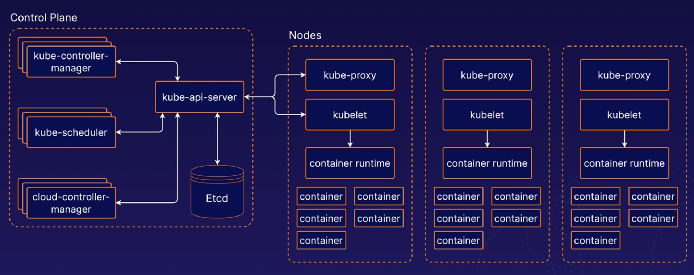

# Kubernetes Architectual

#
## Control Plane
**<u>`Control Plane`</u>** - is collection of multiplay components responsible for managing the cluster itself globally. Essentially **the control plane controls the cluster**.

**<u>`kube-api-server`</u>** - serves the Kubernetes API, the primery interface to the control plane and the cluster itself, to interface kubernetes cluster you usually do so using the Kubernetes API.

**<u>`Etcd`</u>** - is the backend data store for the kubernetes cluster, it provides high-availability storage for all data relating to the state of the cluster.

**<u>`kube-scheduler`</u>** - handles scheduling, the procces of selecting an available node in the cluster on which to run containers.

**<u>`kube-controller-manager`</u>** - runs a collection of multiple controller utilities in a single proccess.
These controllers carry out a variety of automation-related tasks within the kubernetes cluster.

**<u>`cloud-controller-manager`</u>** - provide an interface between Kubernetes and various cloud platforms, It is only used when using cloud-base resources alongside Kubernetes.
#
## Kubernetes Nodes
**<u>`Kubernetes Nodes`</u>** - are the machines where the containers managed by the cluster run. A cluster can have any number of nodes.

Various node components manage containers on the machines and communicate with the `Control Plane`.

**<u>`kubelet`</u>** - is the kubernetes agent that runs on each node, It communicates with the `Control Plane` and ensure that containers are run on its node as instructed by the `Control Plane`.

Kubelet also handels the proccess reporting container status and other data about the containers back to the `Control Plane`.

**<u>`container runtime`</u>** - is not build   into kubernetes, the popular container runtimes are **Docker** or **containerd**.

**<u>`kube-proxy`</u>** - is a network proxy. it runs on each node and hundles some tasks related to providing networking between containers and services in the cluster.